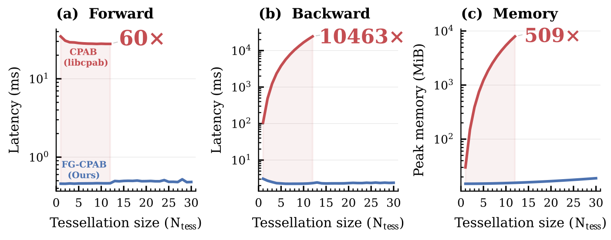

<div align="center">

# FG-CPAB: Factorized Gradients for Scalable Highly-expressive Parametric Diffeomorphisms

[Amit Aflalo](https://amitt1236.github.io)<sup>1</sup> · [Eran Treister](https://www.cs.bgu.ac.il/~erant/)<sup>1</sup> · [Chaim Baskin](https://chaimbaskin.bgu.ac.il)<sup>2</sup> · [Oren Freifeld](https://www.orenfreifeld.com)<sup>1</sup>

<sup>1</sup>The Stein Faculty of Computer and Information Science, Ben-Gurion University of the Negev<br>
<sup>2</sup>School of Electrical and Computer Engineering, Ben-Gurion University of the Negev

**NeurIPS 2026**

[**Project Page**](https://bgu-cs-vil.github.io/FG-CPAB/) · **Paper** (link coming soon) · [**BibTeX**](#citation)

</div>

<p align="center">
  <picture>
    <source media="(prefers-color-scheme: dark)" srcset="docs/assets/fgcpab-scaling-2d-dark.svg">
    
  </picture>
</p>

<p align="center"><em>
FG-CPAB vs. libcpab, the standard CPAB implementation, in 2D (RTX A6000, 125,000 points, batch size 16).
libcpab does not run beyond N<sub>tess</sub> = 12; FG-CPAB scales to N<sub>tess</sub> = 30.
</em></p>

This is the official PyTorch/CUDA implementation of **FG-CPAB**: fast, differentiable CPAB (Continuous Piecewise-Affine Based) diffeomorphisms in 1D, 2D and 3D.

**Try it in the browser:** the [project page](https://bgu-cs-vil.github.io/FG-CPAB/) has interactive demos (sculpting a diffeomorphism, live image registration, point-correspondence fitting) running on a WebGPU port of the CUDA kernels.

## Overview

CPAB transformations parameterize diffeomorphisms through continuous piecewise-affine velocity fields defined on a tessellation of the domain, so the number of parameters `d = dim(θ)` depends on the tessellation rather than on the data resolution. Optimizing them has been held back by the cost of the gradient: the standard approach propagates sensitivities for all `d` parameters through all `T` integration steps of each of the `N` points, an `O(dTN)` backward pass.

FG-CPAB separates trajectory integration from parameter-space projection. A single adjoint sweep accumulates low-dimensional, cell-wise moments that do not depend on `d`, and all parameter gradients are recovered by one sparse projection onto the CPA basis. This reduces the backward complexity from `O(dTN)` to `O(TN + dC)`, where `C` is the number of tessellation cells.

Compared with libcpab:

| | Forward | Gradient | Peak memory |
|---|---|---|---|
| **2D** | up to 75× faster | up to ~10⁴× faster | over 500× lower |
| **3D** | up to 60× faster | up to 4,477× faster | 180× lower |

This makes fine-tessellation CPAB practical in 2D and 3D, and with it much more expressive diffeomorphisms. In the paper, a single FG-CPAB transformation reaches 0.760 Dice on IXI 3D brain MRI registration with fewer than 0.0001% non-positive Jacobians, using per-pair optimization and no pre-training.

## Installation

Requirements:

- An NVIDIA GPU with a CUDA-enabled PyTorch build
- The CUDA toolkit (`nvcc`) matching your PyTorch CUDA version, and `ninja`
- `numpy`; the examples also use `matplotlib` and `Pillow`

```bash
git clone https://github.com/BGU-CS-VIL/FG-CPAB.git
cd FG-CPAB
pip install ninja numpy matplotlib pillow
```

There is no separate build step. The CUDA kernels are compiled just-in-time with `torch.utils.cpp_extension` the first time `cpab` is imported, so the first import takes a while. Run your code from the repository root, or add it to `PYTHONPATH`.

The CPA basis for each tessellation is computed once and cached under `basis_files/`.

## Quick start

```python
import torch
from cpab import Cpab

T = Cpab([20, 20], zero_boundary=True)    # 20x20 tessellation of [0, 1]^2

# Sample a transformation on the GPU.
theta = T.sample_transformation(n_sample=1)

# Build a regular grid in [0, 1]^2 and transform it.
grid = T.uniform_meshgrid([128, 128])      # [2, 16384]
grid_t = T.transform_grid(grid, theta)     # [1, 2, 16384]

# Warp dense data directly.
image = torch.rand(1, 1, 128, 128, device="cuda")
image_t = T.transform_data(image, theta, outsize=[128, 128])
```

Everything is differentiable with respect to `theta`, so you can fit a transformation with any PyTorch optimizer:

```python
theta = T.identity(n_sample=1).requires_grad_(True)
optimizer = torch.optim.Adam([theta], lr=1e-2)

for _ in range(200):
    optimizer.zero_grad()
    loss = (T.transform_data(source, theta, outsize=[128, 128]) - target).pow(2).mean()
    loss.backward()
    optimizer.step()
```

### Composing transformations

A single CPAB transformation is generated by a stationary velocity field. To model deformations that need a time-varying field, compose several CPAB stages with `transform_grid_chain`:

```python
theta_chain = T.sample_transformation(n_sample=4)        # [n_transforms, d]
grid_t = T.transform_grid_chain(grid, theta_chain, scale_by_dt=True)
```

## Examples

```bash
python examples/rectangular_grid_diffeomorphism_1d.py   # 1D transformation of a grid
python examples/rectangular_grid_diffeomorphism_2d.py   # fit a 2D line grid to a swirl, then invert it
python examples/toy_demo_3d.py                          # recover a known 3D transformation of a sphere mesh
```

## Benchmark

```bash
python benchmarks/benchmark_transformer.py --ndim 2 --grid-size 128 --batch-size 16 --tess 10 --iterations 10
```

`--ndim` selects 1D, 2D or 3D, `--tess` sets the tessellation size per axis, and `--nstepsolver` sets the number of integration steps (default 50).

## Repository structure

| Path | Contents |
|---|---|
| `cpab/cpab.py` | The `Cpab` class: tessellation, basis, sampling, transforming grids and data |
| `cpab/core/` | Tessellations and the 1D, 2D and 3D CUDA kernels (forward, adjoint sweep, sparse projection) |
| `cpab/pytorch/` | PyTorch autograd bindings and interpolation |
| `examples/` | 1D, 2D and 3D examples |
| `benchmarks/` | Runtime and memory benchmark |
| `docs/` | Project page with the WebGPU demos ([details](docs/README.md)) |

## Citation

If you find this work useful, please cite FG-CPAB and the original CPAB papers:

```bibtex
@inproceedings{aflalo2026fgcpab,
  title     = {Factorized Gradients for Scalable Highly-expressive Parametric Diffeomorphisms},
  author    = {Aflalo, Amit and Treister, Eran and Baskin, Chaim and Freifeld, Oren},
  booktitle = {Advances in Neural Information Processing Systems},
  year      = {2026}
}
```

```bibtex
@inproceedings{freifeld2015highly,
  title     = {Highly-Expressive Spaces of Well-Behaved Transformations: Keeping It Simple},
  author    = {Freifeld, Oren and Hauberg, S{\o}ren and Batmanghelich, Kayhan and Fisher III, John W.},
  booktitle = {International Conference on Computer Vision (ICCV)},
  year      = {2015}
}
```

```bibtex
@article{freifeld2017transformations,
  title     = {Transformations Based on Continuous Piecewise-Affine Velocity Fields},
  author    = {Freifeld, Oren and Hauberg, S{\o}ren and Batmanghelich, Kayhan and Fisher III, John W.},
  journal   = {IEEE Transactions on Pattern Analysis and Machine Intelligence},
  volume    = {39},
  number    = {12},
  pages     = {2496--2509},
  year      = {2017}
}
```

## Acknowledgements

This code builds on earlier CPAB work. CPAB transformations were introduced by Freifeld et al. [1, 2], and the Python interface follows libcpab [3], the standard CPAB implementation and the baseline in the paper.

1. O. Freifeld, S. Hauberg, K. Batmanghelich, J. W. Fisher III. [Highly-Expressive Spaces of Well-Behaved Transformations: Keeping It Simple](https://openaccess.thecvf.com/content_iccv_2015/html/Freifeld_Highly-Expressive_Spaces_of_ICCV_2015_paper.html). *ICCV*, 2015.
2. O. Freifeld, S. Hauberg, K. Batmanghelich, J. W. Fisher III. [Transformations Based on Continuous Piecewise-Affine Velocity Fields](https://doi.org/10.1109/TPAMI.2016.2646685). *IEEE TPAMI*, 2017.
3. N. S. Detlefsen. [libcpab](https://github.com/SkafteNicki/libcpab). GitHub repository, 2018.

BibTeX for libcpab:

```bibtex
@misc{detlefsen2018libcpab,
  author       = {Detlefsen, Nicki S.},
  title        = {libcpab},
  year         = {2018},
  publisher    = {GitHub},
  journal      = {GitHub repository},
  howpublished = {\url{https://github.com/SkafteNicki/libcpab}}
}
```
